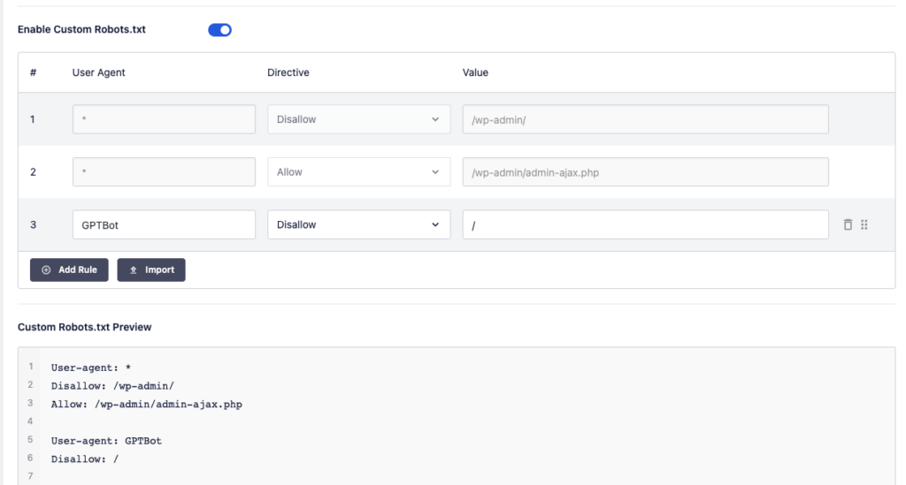

With AI continuing to grow and ChatGPT continuing to be a driving force in the industry, it's important to understand what options you have to better protect your content. In this post, we are going to look at what you need to configure in WordPress to better protect your content. You can stay up to date on the latest changes on OpenAI's crawler by visiting their documentation here.

One thing to note - This will work well for ChatGPT, but this will not work the same for other AI tools out there that can and are crawling your website. This may change in the future, but this is just something to keep in mind for now.

## How it works

Like most web crawlers, the robots.txt file is used by the crawling platform to see what pages are allowed and disallowed from being crawled. Ultimately, this is up to the crawler to obey the allowed list, but not all crawlers will. In the case of ChatGPT, they specifically look for a disallow/allow list for their user agent called GPTBot.

All you need to do is to configure your robots.txt file by adding the following:

``` [robots.txt]
User-agent: GPTBot
Disallow: /
```

## Configure with Yoast SEO

The most popular SEO tool, Yoast, there are two different ways to configure this. First, if you are a Premium Yoast user, then you can go to Yoast SEO -> Settings -> Crawl Optimization and then toggle the option to "Prevent Google Bard and Vertex AI bots from crawling" and "Prevent OpenAI GPTBot from crawling". 

If you are a free Yoast user, then you will need to edit the raw robots.txt file. This is located under Yoast SEO -> Tools -> File Editor. If you don't have a file yet, then you'll see a button to "Create robots.txt file".  If there are no edits made to the file yet, then you'll see a file like this:

``` [robots.txt]
# START YOAST BLOCK
# ---------------------------
User-agent: *
Disallow:

Sitemap: https://wp.caleb-smith.dev/sitemap_index.xml
# ---------------------------
# END YOAST BLOCK
````

After the "END YOAST BLOCK" line, add the ChatGPT specific disallow:

``` [robots.txt]
User-agent: GPTBot
Disallow: /
```

One you are done, save the changes. You are good to go!

## Configure with AIO SEO

The upcoming popular SEO tool, All-In-One SEO, gives you a slightly better experience regardless of whether you pay for the plugin or not. First, navigate to All-In-One SEO -> Tools -> Robots.txt Editor, then you'll see a screen like the image below. I've pre-filled the row you want to add with the correct option for ChatGPT.



## Conclusion

That wraps up how to handle the ChatGPT crawler for your web content. If neither of these options work for your WordPress site, then be sure to chat with your SEO plugin developer on how to set this up for your website. If you are not using WordPress, then following the advice from the first section of this post should be enough for you.